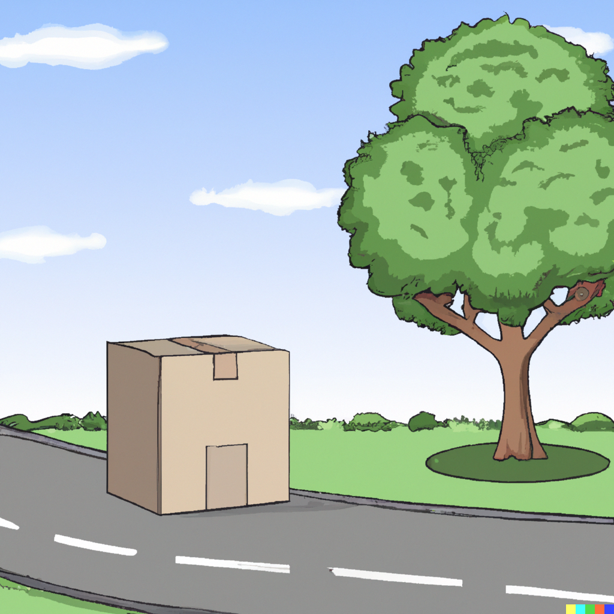
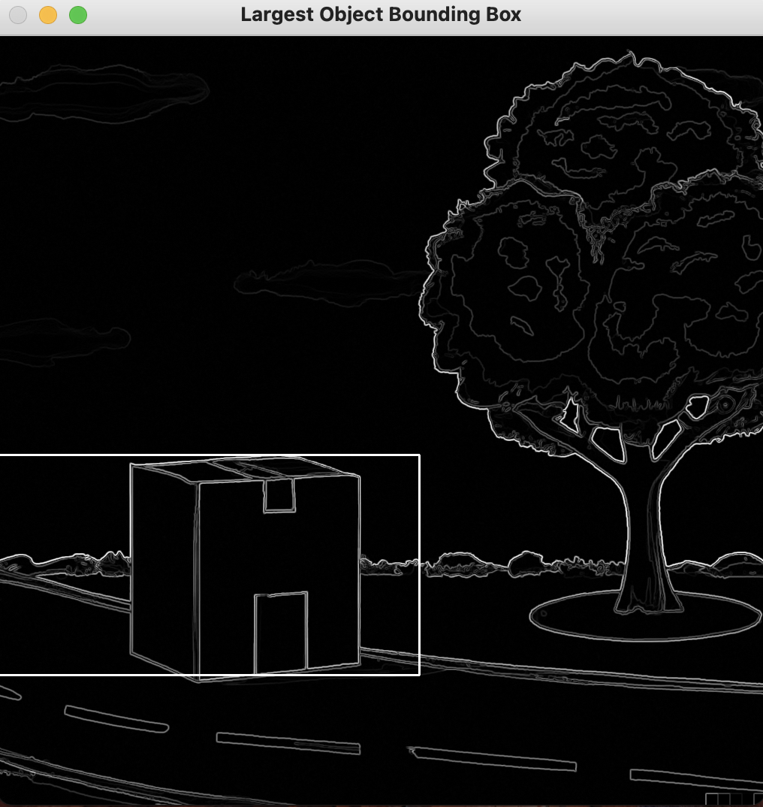

# Edge Detect: Implementing the Sobel filter for image processing

---

Source code for an edge detection technique that emulates the Opencv library fundamentals. Edge detection is very important in image processing, especially in visual prosthesis, as it is important to avoid over-stimulation so that the brain can process the data. 

### Edge Detection: 

Edge detection works by recognising boundaries so that an image can be segmented and individual objects can be identified. This is important in visual prosthesis as there is a trade-off for importance, meaning that certain objects must be detected and others can be disregarded. 

### The Sobel Filter

| -1  |  0  |  1  |      
|:---:|:---:|:---:|
| -2  |  0  |  2  |
| -1  |  0  |  1  |

#### Vertical

|  1  |  2  |  1  |
|:---:|:---:|:---:|
|  0  |  0  |  0  |
| -1  | -2  | -1  |

#### Horizontal

|  0  |  0  |  0  | 0   | 0   | 0   |
|:---:|:---:|:---:|-----|-----|-----|
|  0  |  0  |  0  | 0   | 0   | 0   |
|  0  | 10  | 10  | 10  | 10  | 0   |
|  0  | 10  | 10  | 10  | 0   | 0   |
|  0  |  0  | 10  | 10  | 0   | 0   |
|  0  |  0  |  0  | 0   | 0   |  0  |

#### Image to identify given object

 

#### Output Image

The sobel filter works to show exactly where an object is on the image by using two 3x3 convolution kernels (Vertical, Horizontal). The kernels emphasise the change in intensity in their given directions. 
Each kernel is multiplied by all different sections of the image, ultimately cancelling out in the output to give the coordinates of the desired object. 

For example: 

After multiplying each kernel bv all points of the image, the output for identifying the box may look like the below; 

|  0  |  0  |  0  | 0   | 0   | 0   |
|:---:|:---:|:---:|-----|-----|-----|
|  0  |  0  |  0  | 0   | 0   | 0   |
|  0  |  0  | 10  | 0   | 0   | 0   |
|  0  | 10  |  0  | 10  | 0   | 0   |
|  0  |  0  | 10  | 0   | 0   | 0   |
|  0  |  0  |  0  | 0   | 0   |  0  |

#### Output

### Gradient Magnitude

For each pixel in the image combining the gradient values from the x and y directions to compute the overall edge strength. 

### Edge Direction 

This can be computed by: arctan(Gy/Gx)
